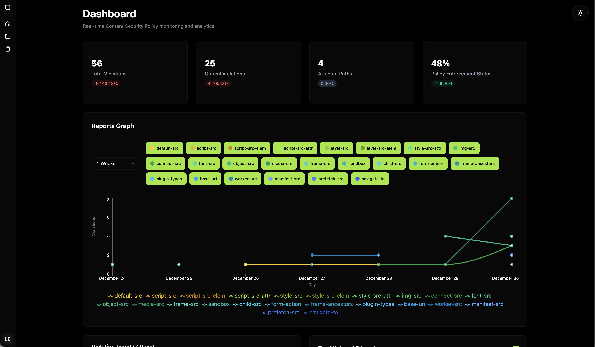

# cspotlight

**cspotlight** is an open-source CSP report collector and analyzer designed to help security engineers and developers monitor, analyze, and respond to browser-enforced Content Security Policy violations.

Reports are organized into projects, which are identified by a unique reporting URL. 
Projects can be considered workspaces and are used to group CSP violation reports. All users are required to have a project created and have a team assigned before they can start using the platform.

---

## 🚀 Features

- **CSP Report Collection**: Receive and store incoming CSP violation reports
- **Analytics Dashboard**: Visualize violations by source, type, page, and frequency
- **Dockerized & Deployable**: Run locally or deploy via Docker platforms

---

## 📸 Screenshots


---

## 🛠️ Getting Started

### Prerequisites

- Go 1.23+
- PostgreSQL 16+
- Docker (optional for container-based deployment)

### Installation (Docker)
Run the commands below and visit http://localhost:5173

```bash
git clone https://github.com/notFil/cspotlight.git
cd cspotlight
docker compose up --build
```

### Roles
- **Super Admin**: Has full access to all features and can manage projects, teams, and users.
- **Admin**: Has full access to all features, but can only manage projects.
- **User**: Has access to all features except general platform management.

NOTE: Super Admin is granted to the first user created when the application instance is first run. All other users that are created are disabled by default. Super Admin can enable them.

